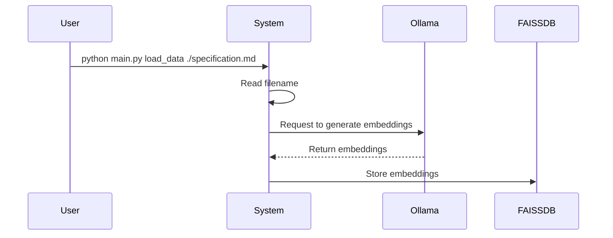
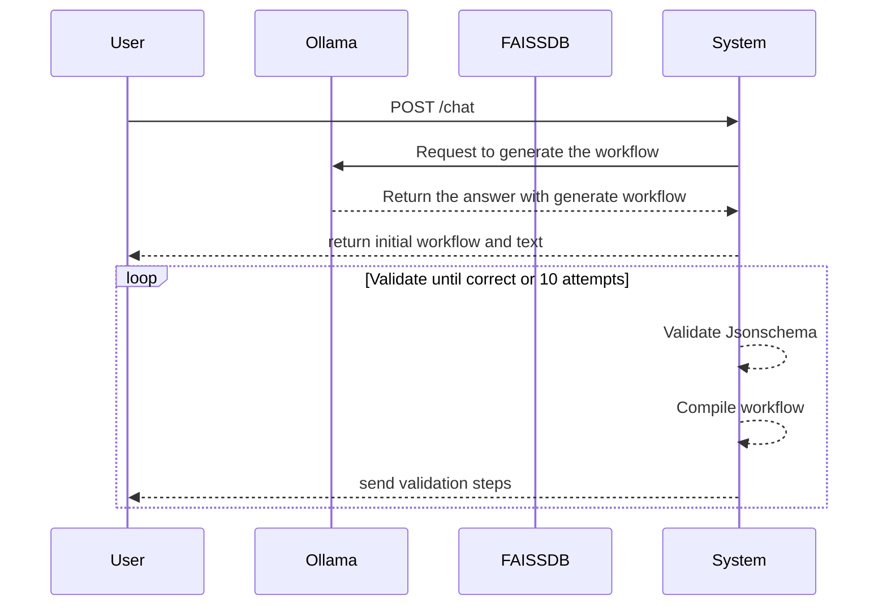

# AI workflow helper

This is a Proof-of-Concept (POC) project designed to aid developers in crafting
Orchestrator workflows. The primary objectives are to:

1. Populate an embedded database with documentation about Orchestrator & serverless
   workflows.
2. Enable the system to generate YAML workflows based on user input.

# Architecture

The POC employs the following components:

-  Ollama for serving Language Model (LLM) models
-  FAISSDB for storing embeddings required by Retrieval-Augmented Generation
   (RAG)
-  Python terminal application using Click framework for some commands
-  API for interact with chats.
-  Small web-app to interact with the system

# Installation:

```bash
python -m venv env
source env/bin/activate
pip install -r req.txt
```

## Development:

Run the server

```
python main.py run
```


Sample request:
```
python main.py sample-request spacex
```

Checks:

```
ruff check
```

# Commands

## Load Data

```
python main.py load_data $filename
```

This command loads a file, requests Ollama to generate embeddings, and stores
them in a local FAISSDB.



## run

```
python main.py run
```

This will create a web server on port 5000, and user can use the browser to
iterate over it.

# Environment Variables

| Environment Variable    | Default Value                                                | Description                                   |
|-------------------------|--------------------------------------------------------------|-----------------------------------------------|
| `OLLAMA_MODEL`          | `granite-code:8b`                                            | Specifies the model used by Ollama.           |
| `LOG_LEVEL`             | `INFO`                                                       | LOG LEVEL information.                        |
| `OLLAMA_URL`            | `http://localhost:11434`                                     | Base URL for Ollama API.                      |
| `FAISS_DB`              | `/tmp/db_faiss`                                              | Path or reference to the local FAISS database.|
| `WORKFLOW_SCHEMA_URL`   | `https://raw.githubusercontent.com/serverlessworkflow/specification/main/schema/workflow.yaml` | URL for the serverless workflow JSON schema. |
| `SQLITE`                | `chats.db`                                                   | path to store previous chats                  |


# Technology

## Few shot prompting

This application uses the few prompting examples technique to create accurate
workflows, you can see the examples in the following path:

```
./Lib/prompts/examples
```

The idea is to provide the LLM some way to "reasonate" and follow some
instructions just to understand what is a workflow and how to structure it.

## React Agent

Generating code is hard to get it right when there is not a complete dataset of
examples and the model correct, so this app just try to "fix" by itself using a
ReAct model.

Each time that user request something, underneed will happen the following:




And the the same time, the ReAct agent has some few-shot examples in the
following path:

```
./lib/prompts/react/
```

And in the following path, you can see the example input that we send to LLM
for fixing it:

```
cat lib/prompts/react/example1_input.txt
```

## FAQ

## Why not functions?

Fucntions are great, but granite models does not support functions in Ollama
yet. On the other hand, [Granite already support
functions][https://huggingface.co/ibm-granite/granite-20b-functioncalling]


## Roadmap & nice features

- Be able to create a reactive agent based on another model.


## Sample prompts for the app:

This is a collection of prompts that can be used in this tool:

## SpaceX launch

A simple workflow wich get the latest informatin from an spaceX launch and post
to other place:

~~~
First I need to check the next SpaceX launch, to obtain the data I use the following bash command:

NEXT_LAUNCH=$(curl https://api.spacexdata.com/v5/launches/next | jq .date_utc)

after this, I want to save the information in my server, so I normally POST the following inforamtion:

curl -d '{"next_launch": "'${NEXT_LAUNCH}'"}' https://httpbin.org/post

could you generate the workflow with functions and error handling?
~~~

can be tested in local with:

```python
python main.py sample-request spacex
```

## Financial data

This workflow checks how to get the information from financial data.

~~~
I need to create a workflow which checks the financial data for a list of companies and pushed to my service.

The input of the workflow will be like:

{"companies": ["IBM", "APPL"]}

For each company, the data can be get from the following url, where symbol is the company information:

curl -s "https://www.alphavantage.co/query?function=OVERVIEW&symbol=IBM&apikey=demo" | jq '."52WeekHigh"'

When you iterate to all the companies the output should be:

```
[
    {"company": "IBM", "high": $52WeekHighValue},
    {"company": "APPL", "high": $52WeekHighValue},
]
```
And this  result should be post to: "http://acalustra.com/financialData/post"
~~~

can be tested in local with:
```python
python main.py sample-request finance
```
