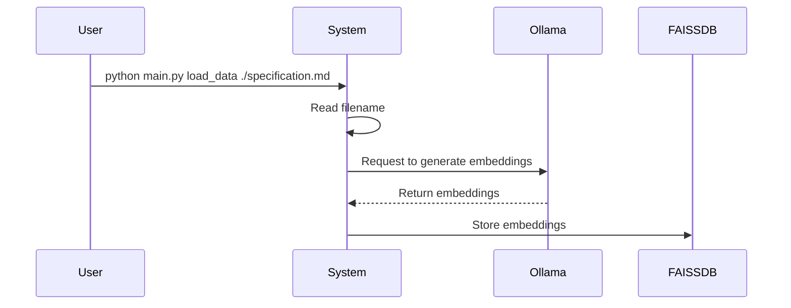

# AI workflow helper

This is a Proof-of-Concept (POC) project designed to aid developers in crafting
Orchestrator workflows. The primary objectives are to:

1. Populate an embedded database with documentation about Orchestrator & Kogito
   workflows.
2. Enable the system to generate YAML workflows based on user input.

# Architecture

The POC employs the following components:

-  Ollama for serving Language Model (LLM) models
-  FAISSDB for storing embeddings required by Retrieval-Augmented Generation
   (RAG)
-  Python terminal application using Click framework
-  API for interact with chats.
-  Small web-app to interact with the system

# Commands

## Load Data

```
python main.py load_data $filename
```

This command loads a file, requests Ollama to generate embeddings, and stores
them in a local FAISSDB.



## run

```
python main.py run
```

This will create a web server on port 5000, and user can use the browser to
iterate over it.

# Environment Variables

| Environment Variable    | Default Value                                                | Description                                   |
|-------------------------|--------------------------------------------------------------|-----------------------------------------------|
| `OLLAMA_MODEL`          | `granite-code:8b`                                            | Specifies the model used by Ollama.           |
| `OLLAMA_URL`            | `http://localhost:11434`                                     | Base URL for Ollama API.                      |
| `FAISS_DB`              | `/tmp/db_faiss`                                              | Path or reference to the local FAISS database.|
| `WORKFLOW_SCHEMA_URL`   | `https://raw.githubusercontent.com/serverlessworkflow/specification/main/schema/workflow.yaml` | URL for the serverless workflow JSON schema. |
| `SQLITE`                | `chats.db`                                                   | path to store previous chats                  |


# Technology

## Few shot prompting

This application uses the few prompting examples technique to create accurate
workflows

## FAQ

## Why not functions?

Fucntions are great, but granite models does not support functions in Ollama
yet. On the other hand, [Granite already support
functions][https://huggingface.co/ibm-granite/granite-20b-functioncalling]


## Roadmap & nice features

- Be able to ask for a workflow with openapi specs from internet and generate
  the workflow, but functions are not enabled.
- Creating diagrams directly from the workflows.


## Sample prompts for the app:

This is a collection of prompts that can be used in this tool:

## SpaceX launch

A simple workflow wich get the latest informatin from an spaceX launch and post
to other place:

~~~
I need to generate the following serverelss workflow:

First I need to check the next SpaceX launch, to obtain the data I use the following bash command:

```
NEXT_LAUNCH=$(curl https://api.spacexdata.com/v5/launches/next | jq .date_utc)
```

after this, I want to save the information in my server, so I normally POST the following inforamtion:

curl -d '{"next_launch": "'${NEXT_LAUNCH}'"}' https://httpbin.org/post

could you generate the workflow please?

~~~
