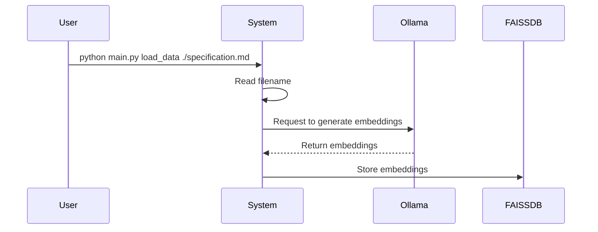
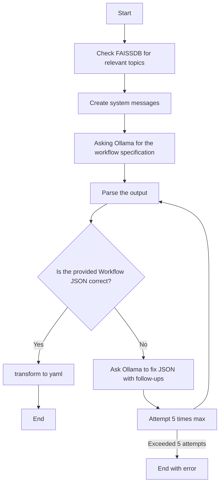

# AI workflow helper

This is a Proof-of-Concept (POC) project designed to aid developers in crafting
Orchestrator workflows. The primary objectives are to:

1. Populate an embedded database with documentation about Orchestrator & Kogito
   workflows.
2. Enable the system to generate YAML workflows based on user input.

# Architecture

The POC employs the following components:

-  Ollama for serving Language Model (LLM) models
-  FAISSDB for storing embeddings required by Retrieval-Augmented Generation
   (RAG)
-  Python terminal application using Click framework, interacting with Ollama
   through Langchain ecosystem


# Commands

## Load Data

```
python main.py load_data $filename
```

This command loads a file, requests Ollama to generate embeddings, and stores
them in a local FAISSDB.



## Chat

```
python main.py load_data "Message"
```

This will do a few things:

This will:

1. Query the FAISSDB for relevant topics based on user input.
2. Generate system messages with some information to share context with LLM.
3. Send all information to Ollama, which responds with data.
4. Parse output and extract Workflow JSON information. If correct, validate
   against serverless workflow JSON schema. If it's not correct, system will
   iterate 5 times to fix the workflow.




Example output:

```
$ --> MESSAGE=$(cat /tmp/message)
$ --> echo $MESSAGE
I would like to get a serverless wofklow which make a request to https://httpbin.org/headers. if the reuqest is 200 OK, please get the response.headers.host from the json, and make another request to https://acalustra.com/provider/post.
$ --> python main.py chat "$MESSAGE"
USER_AGENT environment variable not set, consider setting it to identify your requests.
Query send was:

    I would like to get a serverless wofklow which make a request to
    https://httpbin.org/headers. if the reuqest is 200 OK, please get the
    response.headers.host from the json, and make another request to
    https://acalustra.com/provider/post.

The response is:
 do:
-   requestHeaders:
        call: http
        with:
            endpoint: https://httpbin.org/headers
            method: get
-   checkStatus:
        switch:
        -   case1:
                then: processResponse
                when: .status == 200
-   processResponse:
        set:
            host: .headers.host
-   postToProvider:
        call: http
        with:
            body:
                host: '{{ .host }}'
            endpoint: https://acalustra.com/provider/post
            method: post
document:
    dsl: 1.0.0-alpha1
    name: get-host-and-post-to-provider
    namespace: examples
    version: 1.0.0-alpha1
```

# Environment Variables

| Environment Variable    | Default Value                                                | Description                                   |
|-------------------------|--------------------------------------------------------------|-----------------------------------------------|
| `OLLAMA_MODEL`          | `granite-code:8b`                                            | Specifies the model used by Ollama.           |
| `OLLAMA_URL`            | `http://localhost:11434`                                     | Base URL for Ollama API.                      |
| `FAISS_DB`              | `/tmp/db_faiss`                                              | Path or reference to the local FAISS database.|
| `WORKFLOW_SCHEMA_URL`   | `https://raw.githubusercontent.com/serverlessworkflow/specification/main/schema/workflow.yaml` | URL for the serverless workflow JSON schema. |


## FAQ

## Why not functions?

Fucntions are great, but granite models does not support functions in Ollama
yet. On the other hand, [Granite already support
functions][https://huggingface.co/ibm-granite/granite-20b-functioncalling]


## Roadmap & nice features

- Be able to ask for a workflow with openapi specs from internet and generate
  the workflow, but functions are not enabled.
- Creating diagrams directly from the workflows.
